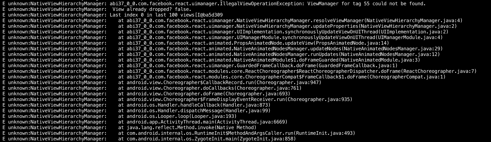

# Reproduce example

How to reproduce this error [issue](https://github.com/callstack/react-native-paper/issues/893)

- clone this npm i
- expo start --android
- after its running on emulator/device
- open adb logcat
- refresh and you'll see the error like below
- the crash recovers using expo, but on a production app it displays a white screen when it crashes and then recovers. Resulting in a long startup

